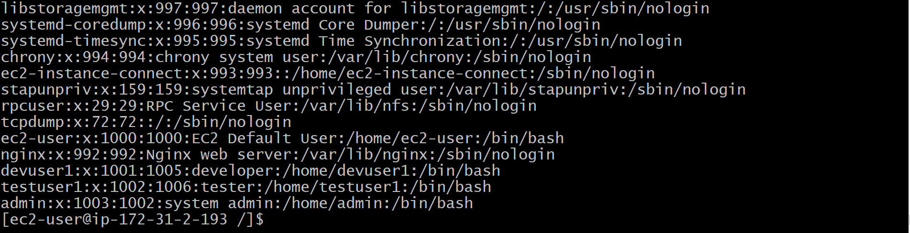

# 🔐 Linux User & Access Management Project  

## 📖 Project Overview  
This project demonstrates how to configure a secure multi-user environment in Linux using:  
- User and Group Management  
- File Permissions & Ownership  
- SSH Key-Based Authentication  
- Sudo Access Control  

The goal is to simulate a real-world scenario where different teams (developers, admins, testers) have access to only their respective project directories.  

---

## ⚡ Features  
✔️ Created multiple groups (developers, admins, testers)  
✔️ Added users and assigned them to groups  
✔️ Set role-based permissions for project directories  
✔️ Configured SSH login for secure access  
✔️ Managed sudo privileges for different groups  

---

## 🔑 Commands Used  

### 1. Create Groups  
sudo groupadd developers
sudo groupadd admins
sudo groupadd testers  

###  2. Create Users
sudo useradd  -c "developer"  -s /bin/bash -G developers devuser1
sudo useradd  -c "system admin" -s /bin/bash -G admins admin1
sudo useradd  -c "tester" -s /bin/bash -G testers tester1

### 3. Create Project Directories
sudo mkdir -p /project/dev /project/admin /project/test

### 4. Assign Ownership and Permissions
## Developers
sudo chgrp developers /project/dev
sudo chmod 770 /project/dev

## Admins
sudo chgrp admins /project/admin
sudo chmod 770 /project/admin

## Testers## 5. Screenshots

### i. Create Groups  

### ii. Create Users and Add into Groups  

### iii. List of Groups  

### iv. List of Users  

### v. Give Read, Write, Execute Permission & SGID  

### vi. Remove SGID  

### vii. Generate SSH Public & Private Keys  

sudo chgrp testers /project/test
sudo chmod 770 /project/test

### 5. screenshots
 Create groups -[Addgroups ](screenshot/addgroups.png) ,
ii. Create users and add into groups -[Addusers & add into groups](screenshot/addusers.png) ,
iii. Total gorps -[Groups](screenshot/groups.png) ,
iv. Users -[Users](screenshot/users.png) ,
vi. Give read,write,execute pemission& sgid -[Give rwx permission& sgid](screenshot/permission.png) ,
vii. Remving sgid -[Remove sgid](screenshot/removesg.png) ,
viii. Generate ssh public& private keys -[generate keys](screenshot/sshkey.png) 

